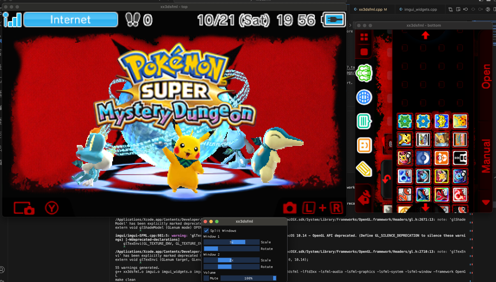
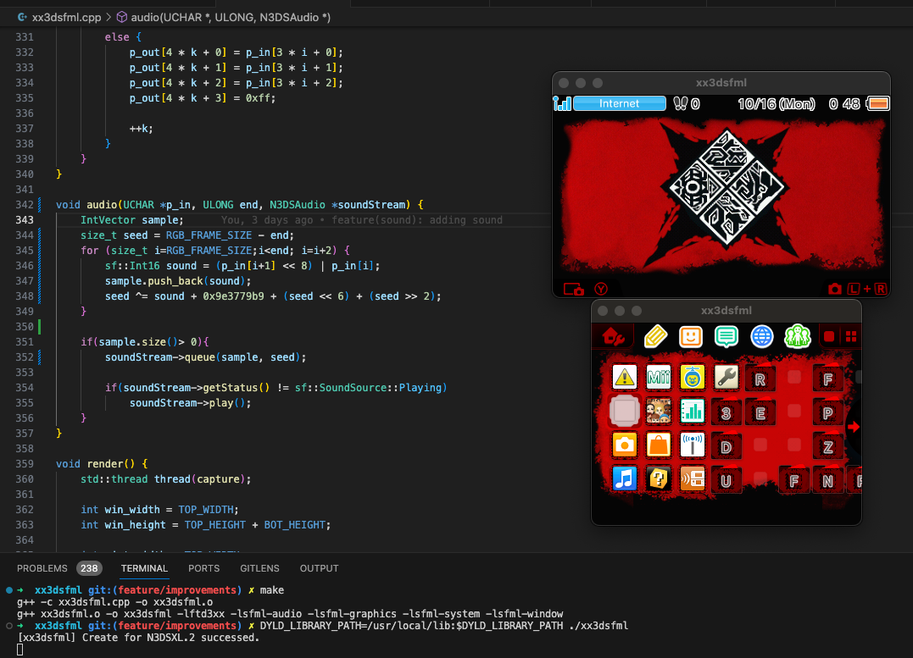

# **xx3dsfml**

xx3dsfml is a multi-platform capture program for [3dscapture's](https://3dscapture.com/) N3DSXL capture card written in C/C++.

#### Dependencies

*Note: The following instructions are for Linux.*

xx3dsfml has two dependencies, [FTDI's D3XX driver](https://ftdichip.com/drivers/d3xx-drivers/) and [SFML v2.6](https://www.sfml-dev.org/).

The D3XX driver can be downloaded from the link above which also contains the installation instructions. However, in order to compile the xx3dsfml.cpp code, two additional steps need to be taken:

1. A directory named libftd3xx needs to be created in the /usr/include directory.
2. The ftd3xx.h and WinTypes.h header files need to be copied to the newly created libftd3xx directory.

Doing this is the equivalent of installing a development package for a utility via a package manager and will allow **any** C/C++ code/compilers to reference these headers.

The SFML **development** package for **C++** also needs to be installed. C++ is the default language for SFML and is not a binding. This can very likely be installed via your package manager of choice.

#### Install

Installing xx3dsfml is as simple as compiling the xx3dsfml.cpp code. A Makefile utilizing the Make utility and g++ compiler is provided with the following functionality:

1. make:	This will create the executable which can be executed via the ./xx3dsfml command.
2. make clean:	This will remove all files (including the executable) created by the above command.

#### Window modes

Currently support single window and split window to change this startup behavior just change the code before make
#define WINDOWS 1 // for single view
#define WINDOWS 2 // for split view

#### Controls

This branch contains a menu done with imgui
[imgui](https://github.com/ocornut/imgui) [v1.87](https://github.com/ocornut/imgui/archive/refs/tags/v1.87.tar.gz)
[imgui-sfml](https://github.com/SFML/imgui-sfml) [v2.5](https://github.com/SFML/imgui-sfml/archive/refs/tags/v2.5.tar.gz)

When the xx3dsfml program is executed, it will attempt to open a connected N3DSXL for capture once at start. However, an N3DSXL can be connected at any time while the software is running. Sometimes software cannot perform all validation and will ask to reconnect 3ds.

#### Media

